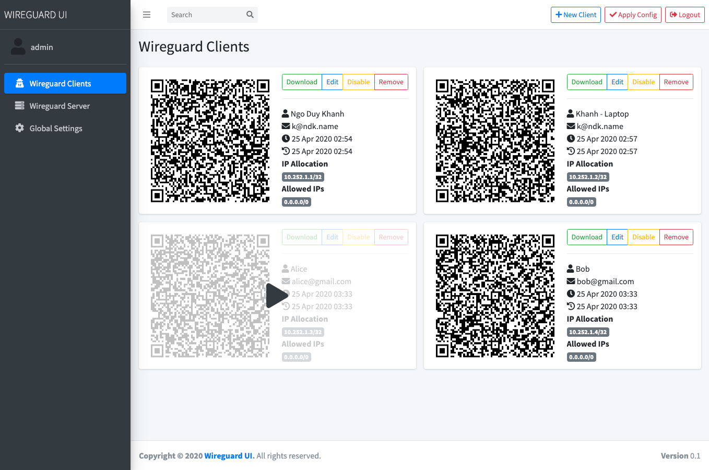

# WireGuard pour YunoHost

[](https://dash.yunohost.org/appci/app/wireguard)    
[](https://install-app.yunohost.org/?app=wireguard)

*[Read this readme in english.](./README.md)*
*[Lire ce readme en français.](./README_fr.md)*

> *Ce package vous permet d'installer WireGuard rapidement et simplement sur un serveur YunoHost.
Si vous n'avez pas YunoHost, regardez [ici](https://yunohost.org/#/install) pour savoir comment l'installer et en profiter.*

## Vue d'ensemble

Réseaux Privés Virtuels (VPN) via WireGuard, avec une web UI pour faciliter sa configuration

**Version incluse :** 0.2.7~ynh5


## Captures d'écran




## Avertissements / informations importantes

* Cette application ajoutera un module DMKS à votre noyau Linux.
  * Vous devriez redémarrer votre serveur pour que WireGuard puisse se lancer.
* Cette application inclut WireGuard et une interface web non-officielle pour le configurer.
  * Évitez de modifier les fichiers de configuration via la ligne de commande.
* Utiliser le panneau de permissions de YunoHost pour autoriser des utilisateurs à accéder à WireGuard UI.
* Une seule interface réseau, *wg0*, peut actuellement être gérée par cette app.

### Partagez votre connexion Internet via WireGuard

#### Activez le *port forwarding*

```bash
sudo nano /etc/sysctl.conf
# Décommentez les lignes suivantes :
net.ipv4.ip_forward = 1
net.ipv6.conf.all.forwarding = 1
# Sauvegardez et quittez (CTRL+O, CTRL+X)
sudo sysctl -p
```

Ajoutez les commandes suivantes dans le menu `WireGuard Server`. Remplacez `eth0` avec l'interface connectée à Internet :

#### Post Up Script
```
iptables -A FORWARD -i %i -j ACCEPT; iptables -A FORWARD -o %i -j ACCEPT; iptables -t nat -A POSTROUTING -o eth0 -j MASQUERADE
```

#### Post Down Script
```
iptables -D FORWARD -i %i -j ACCEPT; iptables -D FORWARD -o %i -j ACCEPT; iptables -t nat -D POSTROUTING -o eth0 -j MASQUERADE
```


## Documentations et ressources

* Site officiel de l'app : https://www.wireguard.com/
* Dépôt de code officiel de l'app : https://github.com/ngoduykhanh/wireguard-ui
* Documentation YunoHost pour cette app : https://yunohost.org/app_wireguard
* Signaler un bug : https://github.com/YunoHost-Apps/wireguard_ynh/issues

## Informations pour les développeurs

Merci de faire vos pull request sur la [branche testing](https://github.com/YunoHost-Apps/wireguard_ynh/tree/testing).

Pour essayer la branche testing, procédez comme suit.
```
sudo yunohost app install https://github.com/YunoHost-Apps/wireguard_ynh/tree/testing --debug
ou
sudo yunohost app upgrade wireguard -u https://github.com/YunoHost-Apps/wireguard_ynh/tree/testing --debug
```

**Plus d'infos sur le packaging d'applications :** https://yunohost.org/packaging_apps